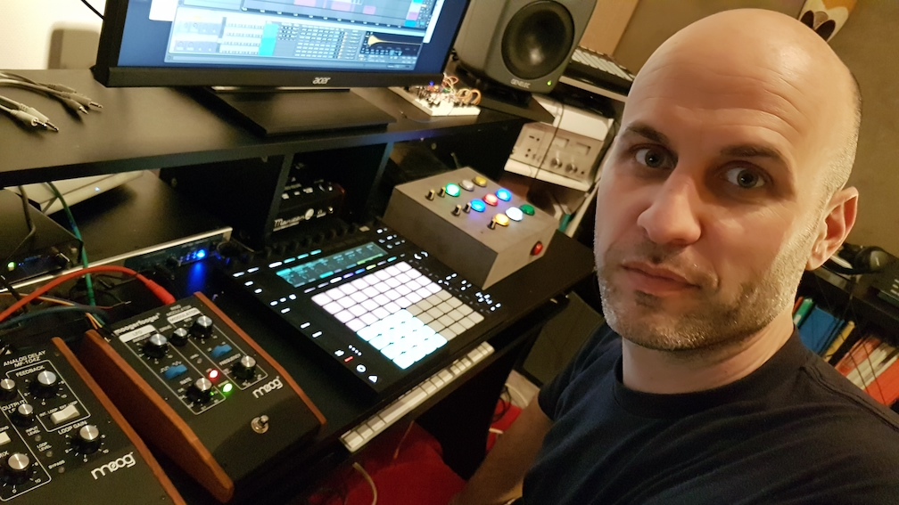

 

<b>open·control</b> was created by <b>Pierre-Antoine GRISON</b>, Ableton Certified Trainer, Consultant, and developer of MIDI controllers and Max For Live devices.

He is also known as <b>Krazy Baldhead</b>, and has released several albums and EPs on the French label Ed Banger Records.

 For enquiries, please use the form below

<form id="fs-frm" name="simple-contact-form" accept-charset="utf-8" action="https://formspree.io/f/xyyowbad" method="post">
  <fieldset id="fs-frm-inputs">
    <label for="full-name">Your Name</label>
    <input type="text" name="name" id="full-name" placeholder="Name" required="">
    <label for="email-address">Email Address</label>
    <input type="email" name="_replyto" id="email-address" placeholder="email@domain.com" required="">
    <label for="message">Message</label>
    <textarea rows="5" name="message" id="message" placeholder="Write your message here." required=""></textarea>
    <input type="hidden" name="_subject" id="email-subject" value="Contact Form Submission">
  </fieldset>
  <input type="submit" value="Submit">
</form>

<b>Find out more  on <a href="https://kblivesolutions.com/en">KB Live Solutions</a></b>

