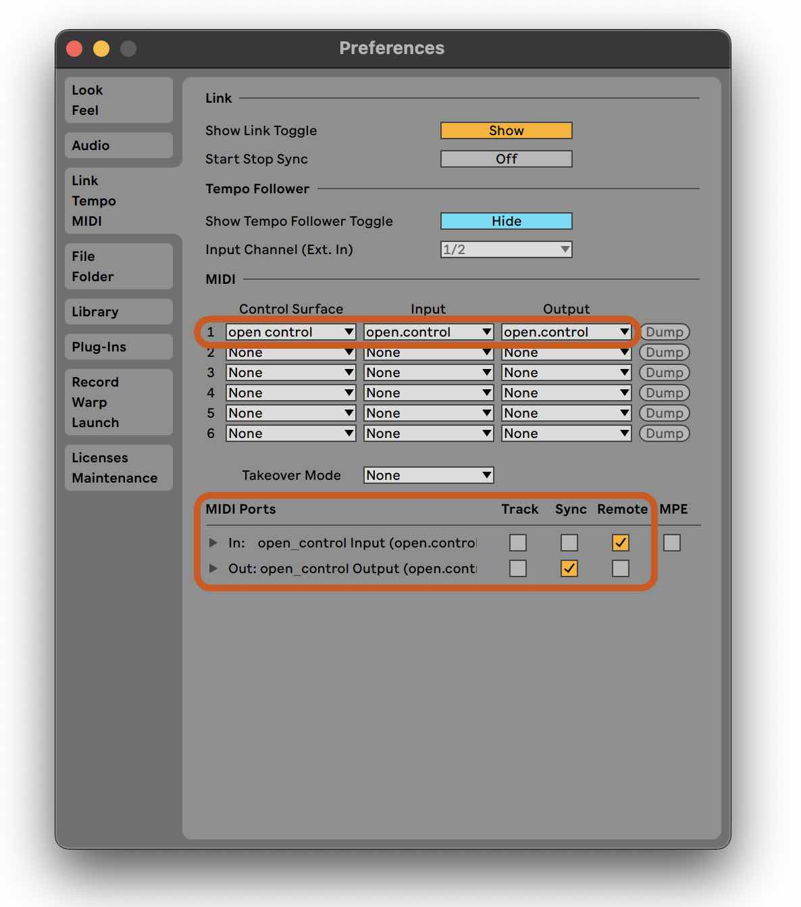

<!-- #  Videos -->

# Thank you for purchasing open·control !

1. Create a folder named `Remote Scripts` in your Ableton User Library (you can find the location of the User Library in the "Library" tab of Live's Preferences).
2. [Download](https://github.com/KBLiveSolutions/open.control-Remote-Script/archive/refs/heads/main.zip) the Control Surface script.
3. Unzip the file, copy the folder `open_control` inside it and paste it into the `Remote Scripts` folder
4. Launch Live, open the Preferences, and go to the Link/Tempo/MIDI Tab
5. Configure the Preferences as on the picture below :

You should see the color of the LEDs change and open·control display a Scene name.
6. Go to the <a href="https://kblivesolutions.github.io/open.control-editor/" target=_blank>Web Editor</a> or [Download it](https://github.com/KBLiveSolutions/open.control-editor/archive/refs/heads/main.zip) to configure open·control.  
    - Most browsers are compatible with the Web Editor. You can find a complete list [here](https://developer.mozilla.org/en-US/docs/Web/API/MIDIAccess#Browser_compatibility).  
    - A message box asking to let kblivesolutions.github.io use your MIDI devices will appear. Click on Allow.  
  
**You are now ready to fully enjoy open·control. Have fun !**