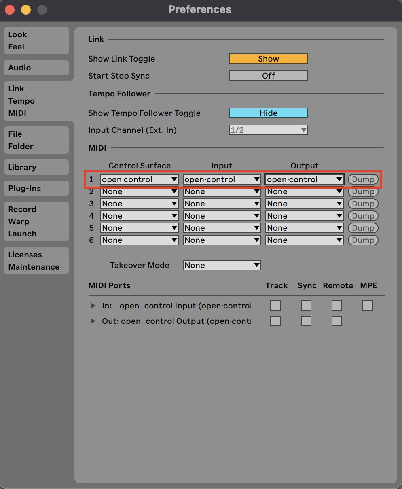

<!-- #  Videos -->

# Welcome to open·control !

### Here are a few steps that will get you started

1. Create a folder named `Remote Scripts` in your Ableton User Library (you can find the location of the User Library in the "Library" tab of Live's Preferences).
2. [Download](https://github.com/KBLiveSolutions/open.control-Remote-Script/archive/refs/heads/main.zip) the latest Control Surface script.
3. Unzip the file, copy the folder `open_control` inside it and paste it into the `Remote Scripts` folder you created
4. Relaunch Live if it was open, open the Preferences, and go to the Link/Tempo/MIDI Tab
5. Configure the MIDI Preferences as below :

    

    You should see the color of the LEDs change and open·control display a Scene name.
6. Go to the <a href="https://kblivesolutions.github.io/open.control-editor/" target=_blank>Web Editor</a> or [Download it](https://github.com/KBLiveSolutions/open.control-editor/archive/refs/heads/main.zip) to configure open·control (compatible browsers: Chrome, Edge and Opera).  
    - A message  asking to let kblivesolutions.github.io use your MIDI devices will appear. Click on Allow. 
  
**You are now ready to fully enjoy open·control. Have fun !**

***Makers****, visit the [for the Makers](https://kblivesolutions.github.io/open.control/ressources/#for-the-makers) section for some explanations.*