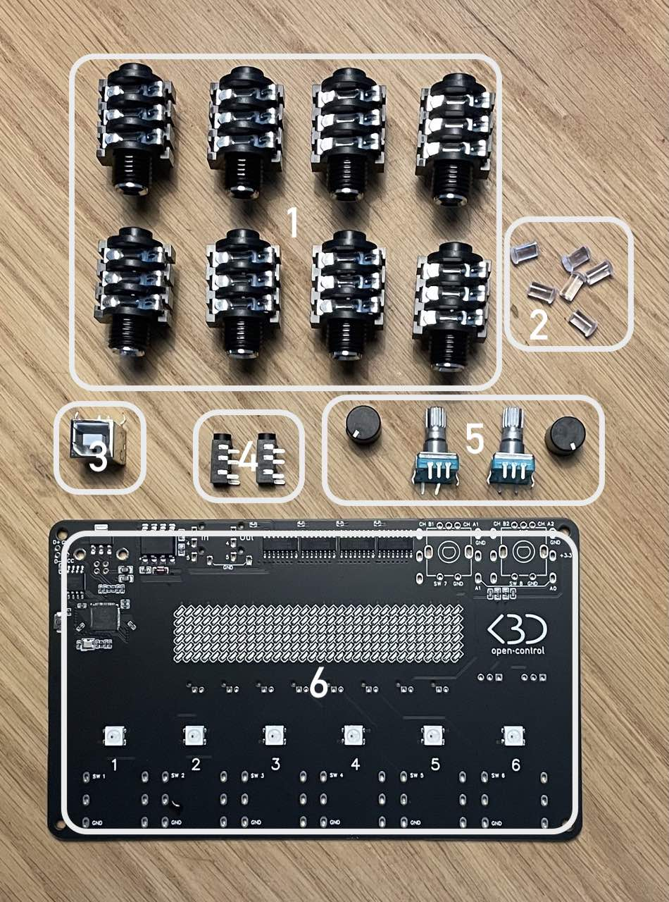
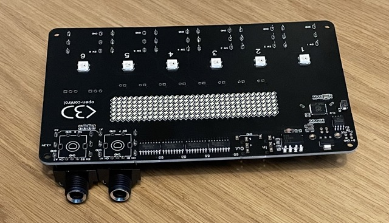
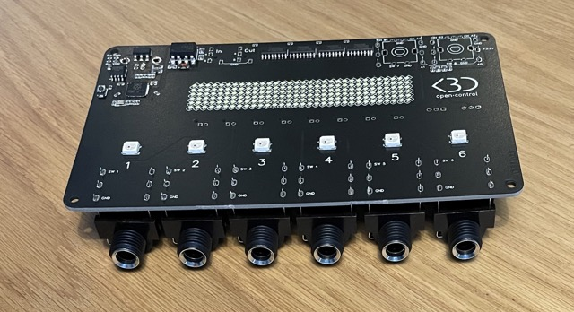
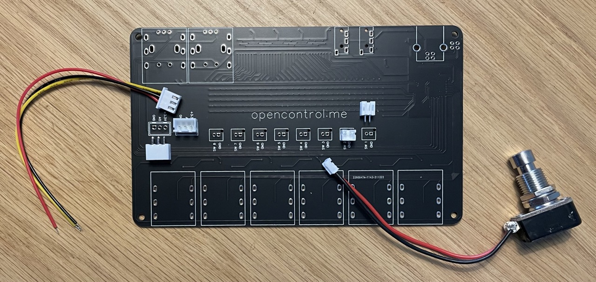
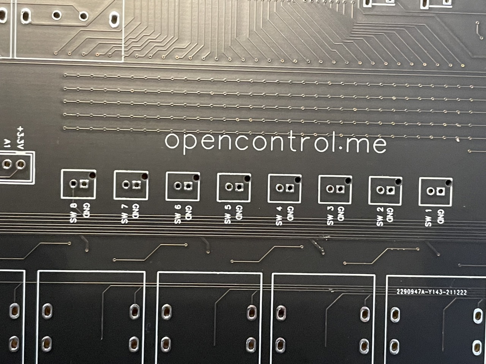
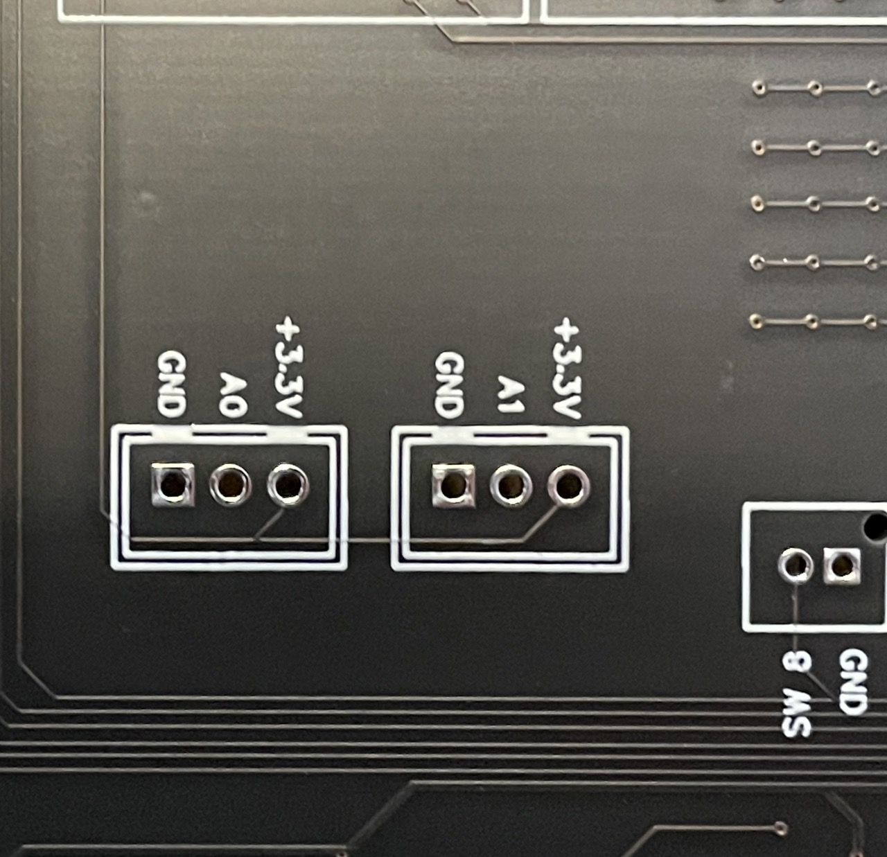
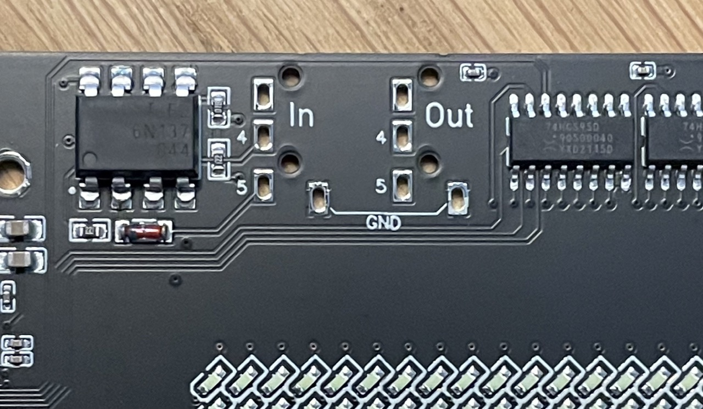
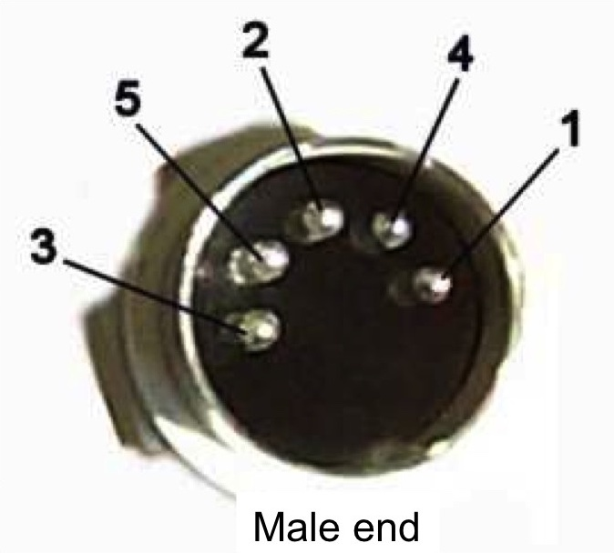
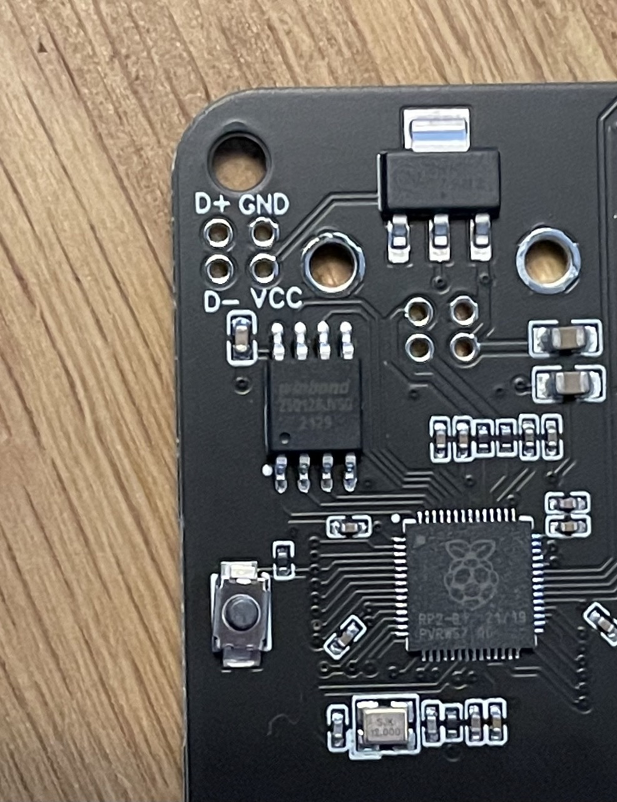
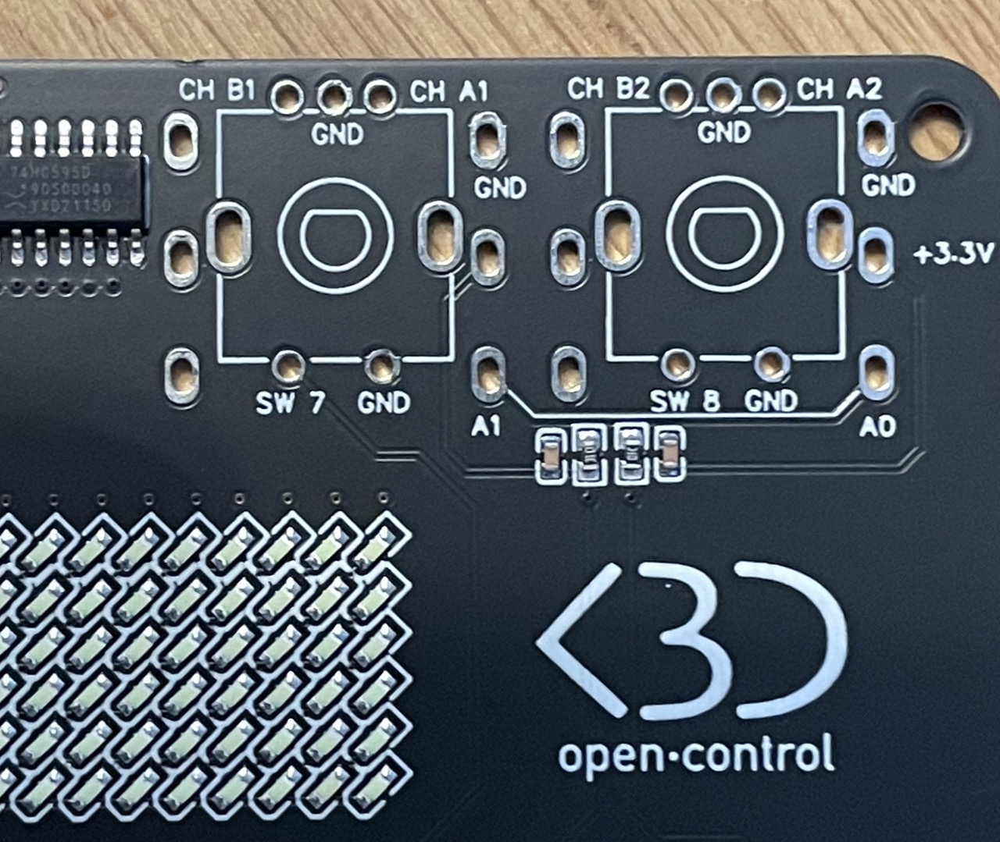

# Ressources

## Videos

### Setting up open·control for Live's Looper {#looper}

  

    <iframe width="560" height="315" src="https://www.youtube.com/embed/2paxKd9Q0rU" title="YouTube video player" frameborder="0" allow="accelerometer; autoplay; clipboard-write; encrypted-media; gyroscope; picture-in-picture" allowfullscreen></iframe>
  

### Creating Setlists {#setlists}

  

    <iframe width="560" height="315" src="https://www.youtube.com/embed/usn9HxS2Gtw" title="YouTube video player" frameborder="0" allow="accelerometer; autoplay; clipboard-write; encrypted-media; gyroscope; picture-in-picture" allowfullscreen></iframe>
  

### open·control demo

  <iframe width="560" height="315" src="https://www.youtube.com/embed/XDOy5wNA_7E" title="YouTube video player" frameborder="0" allow="accelerometer; autoplay; clipboard-write; encrypted-media; gyroscope; picture-in-picture" allowfullscreen></iframe>

 

## List of available Actions {#available-actions}

### Global Actions

| Actions                           | Buttons | LEDs | Sliders | Encoders | CC# |
|-----------------------------------|---------|------|---------|----------|-----|
| ■/▶ Start/Stop                    | *       | *    |         |          |   1 |
| ●○ Metronome                      | *       | *    |         |          |   2 |
| ❚❚ Pause                          | *       |      |         |          | 100 |
| ⧈ Stop All Clips                  | *       |      |         |          |   3 |
| ⤶ Undo                            | *       | *    |         |          |   4 |
| ▢ Capture                         | *       | *    |         |          |   5 |
| ⊕ BPM +1                          | *       |      |         |          |  28 |
| ⊖ BPM -1                          | *       |      |         |          |  29 |
| ± BPM +/- 1                         |         |      |         | *        |  87 |
| ⤷ Redo                            | *       | *    |         |          |  40 |
| ← Re-enable Automation            | *       | *    |         |          |  41 |
| ⮂ Arrangement/Session View Toggle | *       |      |         |          |  75 |
| ⮂ Clip/Device View Toggle         | *       |      |         |          |  76 |
| ℚ MIDI Recording Quantization     | *       | *    |         |          | 104 |
| 🎚 Master Volume                     |         |      | *       | *        |  89 |
| 🎧 Cue Volume                        |         |      | *       | *        |  90 |
| % Global Groove Amount              |         |      | *       | *        |  37 |
| ⟳ Last Selected Parameter           |         |      | *       | *        |  73 |
| ≪≫ Skip Forward/Backward                      |         |      |         | *        |  83 |
| ↔ Horizontal Zoom                   |         |      |         | *        |  99 |
| ↔ Horizontal Scroll                 |         |      |         | *        | 101 |

### Arrangement Actions 

| Actions                           | Buttons | LEDs | Sliders | Encoders | CC# |
|-----------------------------------|---------|------|---------|----------|-----|
| ● Arrangement Rec                 | *       | *    |         |          |   6 |
| ⥁ Arrangement Loop                | *       | *    |         |          |   7 |
| ⇉ Restart From Last Position      | *       |      |         |          | 103 |
| ⇥ Go to Next Marker               | *       |      |         |          |   8 |
| ⇤ Go to Prev Marker               | *       |      |         |          |   9 |
| ⥀ Loop to Next Marker             | *       |      |         |          | 102 |
| ⤓ Add/Delete Marker               | *       |      |         |          |  10 |
| ⌉ Punch In                          | *       | *    |         |          |  38 |
| ⌈ Punch Out                         | *       | *    |         |          |  39 |
| ⇶ Back To Arrangement               | *       | *    |         |          |  42 |
| ↞ Jump to 1.1.1                   | *       |      |         |          |  74 |
| ⤞ Arrangement Loop Start            |         |      |         | *        |  84 |
| ⩉ Arrangement Loop Length           |         |      |         | *        |  85 |
| ↹ Jump to Next/Prev Marker          |         |      |         | *        |  88 |

### Session Actions

| Actions                           | Buttons | LEDs | Sliders | Encoders | CC# |
|-----------------------------------|---------|------|---------|----------|-----|
| ○ Session Rec                     | *       | *    |         |          |  11 |
| ▶ Launch Scene                    | *       | *    |         |          |  13 |
| ⬆ Sel Prev Scene                  | *       | *    |         |          |  14 |
| ⬇ Sel Next Scene                  | *       | *    |         |          |  15 |
| ⇈+4 Jump 4 Scenes Up              | *       |      |         |          | 105 |
| ⇊-4 Jump 4 Scenes Down            | *       |      |         |          | 106 |
| ⥴ Jump to Playing Scene           | *       |      |         |          |  16 |
| ⥅ Insert Scene                    | *       |      |         |          |  17 |
| ⥅ Capture and Insert Scene        | *       |      |         |          |  43 |
| ❶ Fixed Length Rec 1 Bar          | *       |      |         |          | 107 |
| ❷ Fixed Length Rec 2 Bars         | *       |      |         |          | 108 |
| ❹ Fixed Length Rec 4 Bars         | *       |      |         |          | 109 |
| ❽ Fixed Length Rec 8 Bars         | *       |      |         |          | 110 |
| ↕ Scroll Scenes                     |         |      |         | *        |  86 |

### Tracks Actions

| Actions                           | Buttons | LEDs | Sliders | Encoders | CC# |
|-----------------------------------|---------|------|---------|----------|-----|
| ✽ Current Track Color             |         | *    |         |          |  54 |
| ← Sel Prev Track                  | *       | *    |         |          |  18 |
| → Sel Next Track                  | *       | *    |         |          |  19 |
| ▷ Launch Clip                     | *       | *    |         |          |  22 |
| ⌧ Mute                            | *       | *    |         |          |  24 |
| S Solo                            | *       | *    |         |          |  25 |
| ⌻ Arm                             | *       | *    |         |          |  26 |
| ■ Stop                            | *       |      |         |          |  27 |
| ↳ Find Empty Slot                 | *       |      |         |          |  23 |
| ☆ Add Audio Track                 | *       |      |         |          |  20 |
| ✬ Add MIDI Track                  | *       |      |         |          |  21 |
| U Fold/Unfold Track               | *       |      |         |          |  55 |
| ⟊ Volume                            |         |      | *       | *        |  91 |
| ◠ Pan                               |         |      | *       | *        |  96 |
| A Send A                            |         |      | *       | *        |  59 |
| B Send B                            |         |      | *       | *        |  60 |
| ① Selected Device Param 1           |         |      | *       | *        |  61 |
| ② Selected Device Param 2           |         |      | *       | *        |  62 |
| ③ Selected Device Param 3           |         |      | *       | *        |  63 |
| ④ Selected Device Param 4           |         |      | *       | *        |  64 |

### Looper Actions

| Actions                           | Buttons | LEDs | Sliders | Encoders | CC# |
|-----------------------------------|---------|------|---------|----------|-----|
| ◈ Looper State                    |         | *    |         |          |  53 |
| ⧀ Prev Looper                     | *       | *    |         |          |  48 |
| ⧁ Next Looper                     | *       | *    |         |          |  49 |
| ⌻ Arm Looper Track                | *       | *    |         |          |  30 |
| ⌧ Mute Looper Track               | *       | *    |         |          |  31 |
| ▣ Stop Looper                     | *       |      |         |          |  35 |
| ∅ Clear All                       | *       |      |         |          |  36 |
| ⊕ Add Looper                      | *       |      |         |          |  47 |
| ◈ State (LOOPER1)                 |         | *    |         |          |  77 |
| ◈ State (LOOPER2)                 |         | *    |         |          |  78 |
| ◈ State (LOOPER3)                 |         | *    |         |          |  79 |
| ◈ State (LOOPER4)                 |         | *    |         |          |  80 |
| ◈ State (LOOPER5)                 |         | *    |         |          |  81 |
| ◈ State (LOOPER6)                 |         | *    |         |          |  82 |

### Setlist Actions

| Actions                           | Buttons | LEDs | Sliders | Encoders | CC# |
|-----------------------------------|---------|------|---------|----------|-----|
| ⏮️ Prev Song                       | *       | *    |         |          |  33 |
| ⏭️  Next Song                      | *       | *    |         |          |  34 |
| ▶️ Launch setlist Song             | *       |      |         |          |  44 |
| ▶️Ⓠ Launch setlist Song No Q       | *       |      |         |          |  45 |

### Variations Actions

| Actions                           | Buttons | LEDs | Sliders | Encoders | CC# |
|-----------------------------------|---------|------|---------|----------|-----|
| ⍇ Prev Device                     | *       |      |         |          |  65 |
| ⍈ Next Device                     | *       |      |         |          |  66 |
| ⌃ Prev Variation                  | *       |      |         |          |  67 |
| ⌵ Next Variation                  | *       |      |         |          |  68 |
| ▹ Launch Variation                | *       |      |         |          |  69 |
| ◦ Store Variation                 | *       |      |         |          |  70 |
| ⌁ Randomize Macros                | *       |      |         |          |  71 |
| ↩︎ Recall Last Used                | *       |      |         |          |  72 |

### Pages Actions

| Actions                           | Buttons | LEDs | Sliders | Encoders | CC# |
|-----------------------------------|---------|------|---------|----------|-----|
| ⇆ Page 1/2                        | *       |      |         |          |  50 |
| ⇆ Page 1/3                        | *       |      |         |          |  51 |
| ↩ Prev Page                       | *       |      |         |          |  56 |
| ↪ Next Page                       | *       |      |         |          |  57 |

All CC messages are sent on Channel 16.

##  For the Makers

### List of components

1. 8x 6.35mm Jacks
2. 6x LED light guides
3. 1x USB Socket (already soldered)
4. 2x 3.5mm Jacks (MIDI)
5. 2x Encoders with caps
6. PCB Board

### Switches and Pots

You can solder the included 6.35mm Jacks directly to the PCB. 
If you intend to also solder the included [Encoders](#encoders), it is advised to do that first.

You can also connect JST cables like [this](https://www.amazon.fr/gp/product/B07449V33P/ref=ppx_yo_dt_b_search_asin_title?ie=UTF8&psc=1) and solder them at the bottom of the PCB board.

The switches are labelled SW1 to SW8 (SW7 & SW8 are the Encoder switches). 
You can connect any type of momentary switch or button.

You can also connect any potentiometer to the deported slots. 
The variable pin should be connected to the pins labelled A0 and A1.

### MIDI

You can use the included mini jacks sockets or you can use standard DIN5 sockets.

The numbers 4 and 5 on the board refer to this diagram, with pin 2 connected to GND :

### USB

For testing reasons, the USB socket is already conected. However, you can add another socket by using the extra pads.
NB: you won't be able to connect 2 USB cables simultaneously.

### Encoders {#encoders}

There are 2 encoders provided that can be soldered on the board. If you intend to solder the 6.35mm Jack sockets, it is advised to solder the encoders first then the jacks. 
**Before you start soldering, make sure all the legs are inside the holes, they can bend easily when you insert the encoders.**
The CH A1, CH B1, CH A2 and CH B2 are respectively pins 11, 12, 9 & 10 on the RP2040, which means that they can be used for other purposes than an encoder.

See the [List of RP2040 pins](#RP2040pins) for further details.

### List of RP2040 pins {#RP2040pins}

| Pin | Purpose          |
|-----|------------------|
|   0 | Tx               |
|   1 | Rx               |
|   2 | Switch 1         |
|   3 | Switch 2         |
|   4 | Switch 3         |
|   5 | Switch 4         |
|   6 | Switch 5         |
|   7 | Switch 6         |
|   8 | RGB LEDs         |
|   9 | Encoder 2 Ch A   |
|  10 | Encoder 2 Ch B   |
|  11 | Encoder 1 Ch A   |
|  12 | Encoder 1 Ch B   |
|  13 | Encoder 2 Switch |
|  14 | Encoder 1 Switch |
|  15 |                  |
|  16 | LED Matrix Row 1 |
|  17 | LED Matrix Row 2 |
|  18 | LED Matrix Row 3 |
|  19 | LED Matrix Row 4 |
|  20 | LED Matrix Row 5 |
|  21 | LED Matrix Row 6 |
|  22 | toggle_Col       |
|  23 | clock_Col        |
|  24 | latch_Col        |
|  25 | data_Col         |
|  26 | A0               |
|  27 | A1               |

