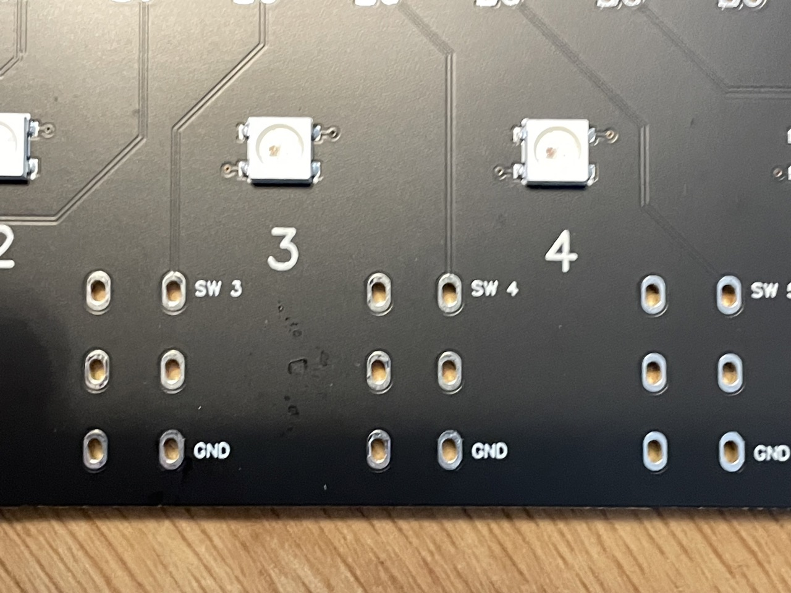

<!-- #  Videos -->

## List of Available Actions

<table class="action_table" id="leds_table">
  <thead>
      <tr>
          <th colspan="2">Display</th>
      </tr>
  </thead>
  <tbody>
  <tr>
      <td class="light" style="border-bottom-right-radius: 12px; border-bottom-left-radius: 12px;">Scene Name · Track Name · Arrangement Marker Name · Variation Number · Looper Number</td>
  </tr>
</tbody>
</table>

<table class="action_table" id="leds_table">
  <thead>
      <tr>
          <th colspan="2">Buttons</th>
      </tr>
  </thead>
  <tbody>
  <tr>
      <td class="light"><b>Global</b> :   Start/Stop* · Continue Playing ·  Metronome* · Undo/Redo · Capture* · BPM +/-1 · Arr / Session View Toggle · Re-enable Automation* · MIDI Record Quantization* · Show Arrangement/Session View</td>
  </tr>
  <tr>
      <td><b>Arrangement</b> :   Arrangement Rec* · Arrangement Loop* · Go to Prev/Next Marker · Add/Delete Marker · Loop to Next Marker · Punch In / Punch Out* · Jump to 1.1.1 · Back To Arrangement*</td>
</tr>
  <tr>
      <td class="light"><b>Session</b> :   Session Record* · Launch Scene* · Select Next/Prev Scene* · Fixed Length Recording · Insert Scene · Stop All Clips</td>
  </tr>
  <tr>
      <td ><b>Tracks</b> :   Launch Clip* · Record Clip* · Find Next Empty Slot · Mute* · Solo* · Arm* · Stop · Select Prev/Next Track* · Add Audio/MIDI Track</td>
  </tr>
<tr>
  <td class="light"><b>Variations</b> :   Launch, Store or Recall Variations · Randomize Macros · Select Prev/Next Variation · Select Prev/Next Device</td>
  </tr>
      <tr>
        <td style="border-bottom-right-radius: 12px; border-bottom-left-radius: 12px;"> <b>Looper</b> :   Rec/Play/OVR per Looper* · Select Prev/Next Looper* · Clear 1 · Clear All · Arm/Mute Looper Track* · 6 MIDI-Mapable buttons per Looper
        </td>
  </tr>
</tbody>
</table>

* : visual feedback available

<table class="action_table" id="leds_table">
  <thead>
      <tr>
          <th colspan="1">Encoders</th>
      </tr>
  </thead>
  <tbody>
  <tr>
      <td ><b>Global</b> :  
    Last Selected Parameter · Global Groove Amount · Master Volume· Cue Volume · BPM +/- 1 · Scroll Scenes</td>
  </tr>
  <tr>
      <td class="light"><b>Arrangement</b> :  
    Skip Forward/Backward · Loop Position · Loop Length · Jump to Next/Prev Marker · Horizontal Zoom</td>
  </tr>
  <tr>
      <td style="border-bottom-right-radius: 12px; border-bottom-left-radius: 12px;"><b>Selected Track</b> :   Volume · Pan · Send A · Send B · Selected Device Parameters 1 to 4</td>
  </tr>
</tbody>
</table>

<table class="action_table" id="leds_table">
  <thead>
      <tr>
          <th colspan="1">Expression Pedals</th>
      </tr>
  </thead>
  <tbody>
  <tr>
      <td ><b>Global</b> :  
    Last Selected Parameter · Global Groove Amount · Master Volume· Cue Volume</td>
  </tr>
  <tr>
      <td class="light"><b>Selected Track</b> :   Volume · Pan · Send A · Send B</td>
  </tr>
  <tr>
      <td style="border-bottom-right-radius: 12px; border-bottom-left-radius: 12px;"><b>Selected Device</b> :   Parameters 1 to 4</td>
  </tr>
</tbody>
</table>

## For the Makers

### List of components

1. 8x 6.35mm Jacks
2. 6x LED light guides
3. 1x USB Socket (already soldered)
4. 2x 3.5mm Jacks (MIDI)
5. 2x Encoders with caps
6. PCB Board

### Switches

You can solder the included 6.35mm Jacks directly to the PCB.

You can also connect JST cables like [this](https://www.amazon.fr/gp/product/B07449V33P/ref=ppx_yo_dt_b_search_asin_title?ie=UTF8&psc=1) and solder them at the bottom of the PCB board.

The switches are labelled 1 to 8 (7 & 8 are the Encoder switches). You can connect any type of switch or button.

You can also connect any potentiometer to the deported slots. The variable pin should be connected to the pins labelled A0 and A1.

### MIDI

You can use the included mini jacks sockets or you can use standard DIN5 sockets.

The numbers 4 and 5 refer to this diagram

### USB

For testing reasons, the USB socket is already conected. However, you can add another socket by using the extra pads.
NB: you won't be able to connect 2 USB cables simultaneously.

### Encoders

There are 2 encoders provided that can be soldered on the board. If you intend to solder the 6.35mm Jack sockets, it is advised to solder the encoders first then the jacks. 
**Before you start soldering, make sure all the legs are inside the holes, they can bend easily when you insert the encoders.**
The CH A1, CH B1, CH A2 and CH B2 are respectively pins 11, 12, 9 & 10 on the RP2040, which means that they can be used for other purposes than an encoder.

## For the Coders

### List of Control Changes and actions

| Action                       | LED feedback              | CC# |
|------------------------------|---------------------------|-----|
| ■/▶ Start/Stop               | ■/▶ Start/Stop            |   1 |
| ●○ Metronome                 | ●○ Metronome              |   2 |
| ⧈ Stop All Clips             |                           |   3 |
| ⤶ Undo                       |                           |   4 |
| ▢ Capture                    |                           |   5 |
| ● Arrangement Rec            | ● Arrangement Rec         |   6 |
| ⥁ Arrangement Loop           | ⥁ Arrangement Loop        |   7 |
| ⇥ Go to Next Marker          |                           |   8 |
| ⇤ Go to Prev Marker          |                           |   9 |
| ⤓ Add/Delete Marker          |                           |  10 |
| ○ Session Rec                | ○ Session Rec             |  11 |
| ➟ Disable Follow Actions     |                           |  12 |
| ▶ Launch Scene               | ▶ Scene Color             |  13 |
| ⬆ Sel Prev Scene             | ⬆ Prev Scene Color        |  14 |
| ⬇ Sel Next Scene             | ⬇ Next Scene Color        |  15 |
| ⥴ Jump to Playing Scene      |                           |  16 |
| ⥅ Insert Scene               |                           |  17 |
| ← Sel Prev Track             | ← Prev Track Color        |  18 |
| → Sel Next Track             | → Next Track Color        |  19 |
| ☆ Add Audio Track            |                           |  20 |
| ✬ Add MIDI Track             |                           |  21 |
| ▷ Launch Clip                | ▷ Clip Color              |  22 |
| ↳ Find Empty Slot            |                           |  23 |
| ⌧ Mute                       | ⌧ Mute                    |  24 |
| S Solo                       | S Solo                    |  25 |
| ⌻ Arm                        | ⌻ Arm                     |  26 |
| ■ Stop                       |                           |  27 |
| ⊕ BPM +1                     |                           |  28 |
| ⊖ BPM -1                     |                           |  29 |
| ⌻ Arm Looper Track           | ⌻ Arm Looper Track        |  30 |
| ⌧ Mute Looper Track          | ⌧ Mute Looper Track       |  31 |
|                              |                           |     |
| Prev setlist Song            | Prev setlist Song         |  33 |
| Next setlist Song            | Next setlist Song         |  34 |
| ▣ Stop Looper                |                           |  35 |
| ∅ Clear All                  |                           |  36 |
| Global Groove Amount         |                           |  37 |
| Punch In                     | Punch In                  |  38 |
| Punch Out                    | Punch Out                 |  39 |
| Redo                         |                           |  40 |
| Re-anble automation          | Re-anble automation       |  41 |
| back to arrangement          | back to arrangement       |  42 |
| ⥅ Capture and Insert Scene   |                           |  43 |
| Launch setlist Song          |                           |  44 |
| Launch setlist Song No Q     |                           |  45 |
| Refresh Setlist              |                           |  46 |
| Add Looper                   |                           |  47 |
| ⧀ Prev Looper                | ⧀ Prev Looper Track Color |  48 |
| ⧁ Next Looper                | ⧁ Next Looper Track Color |  49 |
| ⇆ Page 1/2                   | ⇆ Page Color              |  50 |
| ⇆ Page 1/3                   | ⇆ Page Color              |  51 |
|                              | ◈ Looper State            |  53 |
| ✽ Current Track Color        | ✽ Current Track Color     |  54 |
| U Fold/Unfold Track          |                           |  55 |
| ↩ Prev Page                  |                           |  56 |
| ↪ Next Page                  |                           |  57 |
| Send A                       |                           |  59 |
| Send B                       |                           |  60 |
| Selected Device Param 1      |                           |  61 |
| Selected Device Param 2      |                           |  62 |
| Selected Device Param 3      |                           |  63 |
| Selected Device Param 4      |                           |  64 |
| ⍇ Prev Device                |                           |  65 |
| ⍈ Next Device                |                           |  66 |
| ⌃ Prev Variation             |                           |  67 |
| ⌵ Next Variation             |                           |  68 |
| ▹ Launch Variation           |                           |  69 |
| ◦ Store Variation            |                           |  70 |
| ⌁ Randomize Macros           |                           |  71 |
| ↩︎ Recall Last Used           |                           |  72 |
| Last Selected Parameter      |                           |  73 |
| ↞ Jump to 1.1.1              |                           |  74 |
| ⮂ Arrangement/Session Toggle |                           |  75 |
| Clip/Device Toggle           |                           |  76 |
|                              | ◈ State (LOOPER1)         |  77 |
|                              | ◈ State (LOOPER2)         |  78 |
|                              | ◈ State (LOOPER3)         |  79 |
|                              | ◈ State (LOOPER4)         |  80 |
|                              | ◈ State (LOOPER5)         |  81 |
|                              | ◈ State (LOOPER6)         |  82 |
| Skip Forward                 |                           |  83 |
| Arrangement Loop Start       |                           |  84 |
| Arrangement Loop Length      |                           |  85 |
| Scroll Scenes                |                           |  86 |
| BPM +/- 1                    |                           |  87 |
| Jump to Next/Prev Marker     |                           |  88 |
| Master Volume                |                           |  89 |
| Cue Volume                   |                           |  90 |
| Volume                       |                           |  91 |
| Pan                          |                           |  96 |
| Horizontal Zoom              |                           |  99 |
| Continue Playing             |                           | 100 |
| Horizontal Scroll            |                           | 101 |
| ⥀ Loop to Next Marker        |                           | 102 |
| ⇉ Restart From Last Position |                           | 103 |
| MIDI Recording Quantization  |                           | 104 |
| ⬆+4 Jump 4 Scenes Up         |                           | 105 |
| ⬇-4 Jump 4 Scenes Down       |                           | 106 |
| fixed legnth Rec 2 Bars      |                           | 107 |
| Hotswap                      |                           | 108 |
| Load Item                    |                           | 109 |
| select prev item             |                           | 110 |
| select next item             |                           | 111 |

### List of RP2040 pins

| Pin | Purpose          |
|-----|------------------|
|   0 | Tx               |
|   1 | Rx               |
|   2 | Switch 1         |
|   3 | Switch 2         |
|   4 | Switch 3         |
|   5 | Switch 4         |
|   6 | Switch 5         |
|   7 | Switch 6         |
|   8 | RGB LEDs         |
|   9 | Encoder 2 Ch A   |
|  10 | Encoder 2 Ch B   |
|  11 | Encoder 1 Ch A   |
|  12 | Encoder 1 Ch B   |
|  13 | Encoder 2 Switch |
|  14 | Encoder 1 Switch |
|  15 |                  |
|  16 | LED Matrix Row 1 |
|  17 | LED Matrix Row 2 |
|  18 | LED Matrix Row 3 |
|  19 | LED Matrix Row 4 |
|  20 | LED Matrix Row 5 |
|  21 | LED Matrix Row 6 |
|  22 | toggle_Col       |
|  23 | clock_Col        |
|  24 | latch_Col        |
|  25 | data_Col         |
|  26 | A0               |
|  27 | A1               |

