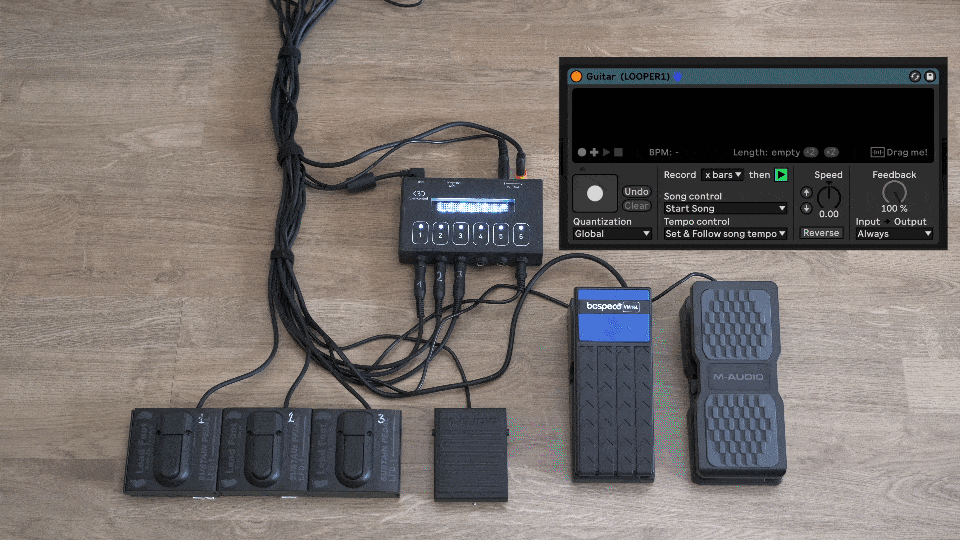

<!-- #  Videos -->

<!-- # open·control, a unique Control Surface for Ableton Live -->

<html>
    

    

      <h3>open·control is a customizable MIDI controller with a <b>large and bright display, 6 buttons with visual feedback</b> and <b>2 knobs.</b> 
        It is available in 3 formats, to use it with <b>pedals, fingers, or to make your own</b>.</h3>
      

       
        <!-- 

            
        

          
        

        Is is Open Source, so all the code is available, and it will continuously improve as its user base grows.

     -->
    
<h1>
1 controller, 3 flavors
</h1>

  <h3>open·control is available in 3 formats.</h3>  

  <b>Pocket</b> is a lightweight desktop controler, <b>Boxed</b> is designed to be used with pedals, and <b>Maker</b> is for the hobbyist who wants to create his own enclosure.

 


 
<h1>
  Control the controls
</h1>

    Each element of the controller can be changed instantly with an easy to use Web Editor (also available offline). 
    You can create up to 3 different pages of controls. 
    No need to reload Live or refresh anything, all changes are applied immediately.

 

  <b>open·control is the only controller available that shows and controls Variations, Scene names, Looper state... amongst many other unique features.</b>  
  Of course you can  use the buttons to do "classic" MIDI mapping. 
  You can find a <a href="./ressources#available-actions">list of available actions</a> and some <a href="./ressources#examples">examples</a> on the Ressources page.

  open·control being Open Source, you can adapt the code to your own needs.

 
<h1>
  Setlists
  </h1>
  <h3>Optimize your live performance with Setlists</h3>
      
You can create setlists by adding (SONG#) to a <b>Scene</b> or <b>Arrangement Marker</b> name 
      You will then be able to go to the next or previous song, and launch the selected song instantly.  
       

 
 
  Your setlist can be as long as you want.  
  You can easily re-organize your Setlist by updating the (SONG#) tags. 
  <a href="./ressources#setlists">More details</a>
   
  <h1>
Looper integration
</h1>
<h3>open·control takes extra care of Live's Looper device</h3>
  
<b>open·control detects any Looper that has (LOOPER#) in its name.</b> You can then navigate through Loopers and control and monitor the state of each Looper individually. 
  Another useful feature is that you can monitor the state of 6 Loopers simultaneously. 
  <a href="./ressources#looper">More details</a>

 

  

 
<h1>
  Custom Actions
  </h1>
  <h3>When 1 action is not enough</h3>
      
If you need to perform more than 1 action when pressing a button, you can create list of actions with "Custom Actions". These actions are created in a special text file, or by renaming Clips inside Live. 
      The syntax is similar to ClyphX, so you can instantly turn existing ClyphX actions into buttons press. This also means that more actions are available.
       
 

 
   

<h1>
  3 MIDI modes</h1>

open·control has  MIDI In and Out ports (stereo 3.5mm minijack), making it possible to connect it in 3 different ways.  
  This is available on all the versions (Pocket, Boxed or Maker).

 


   
  
  <h1>
  Specifications</h1>

<b>Display:</b>
<li>32x6 pixels White LED Matrix</li>
<li>6 RGB LEDs with adjustable brightness</li>
 
<b>Connectors:</b>
<li>USB Type B</li>
<li>Stereo 3.5mm minijack MIDI In & Out</li>
<li><b>Boxed: </b>8 x 6.35mm Jack Inputs (6 Mono for Pedal Switches, 2 Stereo for Expression Pedals)</li>
<li><b>Pocket: </b>6 Buttons and 2 Knobs</li>
 

<b>Dimensions:</b>
<li>Pocket: 15 x 9 X 4 cm</li>
<li>Boxed : 16 x 9.5 X 3.5 cm</li>
 

 <b>To help make the planet a bit greener , <u>no cables are provided with open.control.</u> </b>  
  The USB cable is very standard (Printer type), you probably have one you don't use.

 <h1>
    FAQ
</h1>

<li>Q: Does opencontrol rely on Max For Live ? 
  No, there's no need to have Max For Live</li>
  <li>Q: Why is the display a LED matrix, and not an OLED display ? 
    The main idea behind open·control was to use it on stage and to be able to read it from a certain distance and from any angle. Therefore the best solution was a LED matrix.</li>
  <li>Q: What version of Live are supported ? 
  Any version above Live 9 will work (Lite, Standard, Suite). </li>
  

